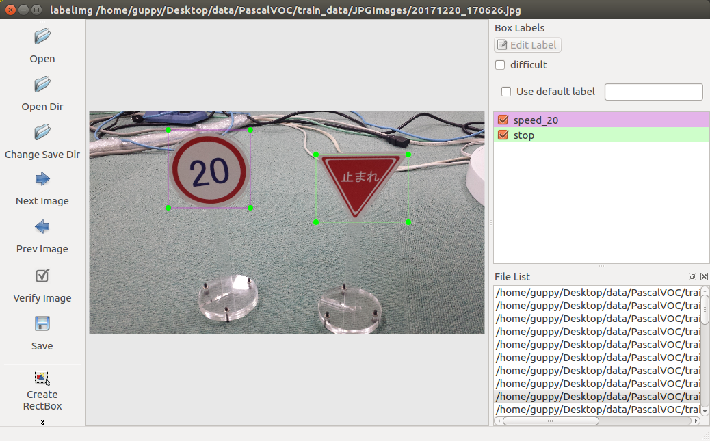

<a name='top'>

# Train ssd_mobilenet of the Tensorflow Object Detection API with your own data.
<hr>

## My training machine<br>
* AWS p3.2xlarge(Tesla V100 16GB 300W)
  * Ubuntu 16.04
  * docker-ce
  * nvidia-docker
    * nvidia/cuda
    * Python 3.6.3/OpenCV 3.3.1/Tensorflow r1.4.1 (build from source)
    * Tensorflow Object Detection API (branch r1.5)
  * nvidia-docker
    * nvidia/cuda:9.0-devel-ubuntu16.04
    * Python 2.7.12/OpenCV 3.4.2/Tensorflow r1.8.0 (build from source)
    * Tensorflow Object Detection API (branch master)

* PC
  * CPU: i7-8700 3.20GHz 6-core 12-threads
  * GPU: NVIDIA GTX1060 6GB 120W
  * MEMORY: 32GB
  * Ubuntu 16.04
  * docker-ce
  * nvidia-docker
    * nvidia/cuda:9.0-devel-ubuntu16.04
    * Pyton 2.7.12/OpenCV 3.4.2/Tensorflow 1.8.0 (build from source)
    * Tensorflow Object Detection API (branch master)

<hr>

<a name='0'>

## Table of contents<br>
* [Create PascalVOC data from your JPG images.](#1)
* [Setting Tensorflow Object Detection API.](#2)
* [Create TF Record data from PascalVOC data.](#3)
* [Training.](#4)
* [Freeze Graph.](#5)
* [Run.](#6)

<hr>

<a name='1'>

## Create PascalVOC data from your JPG images.
* [Install LabelImg on your Ubuntu desktop PC.](#1-1)
  * For Windows PC you can use VMware Player.
* [Make labels by hand.](#1-2)
* [Move files into dirs.](#1-3)
* [Make label_map.pbtxt.](#1-4)
* [Upload to training machine.](#1-5)

<a name='1-1'>

#### Install [LabelImg](https://github.com/tzutalin/labelImg) on your Ubuntu desktop PC.
Install LabelImg.
```
mkdir ~/github
sudo apt-get install -y pyqt4-dev-tools
sudo apt-get install -y python-pip
sudo pip install --upgrade pip
sudo pip install lxml

cd ~/github
git clone https://github.com/tzutalin/labelImg

cd ~/github/labelImg
make qt4py2
```

<a name='1-2'>

#### Make labels by hand.
Make all image's label with LabelImg.
```
cd ~/github/labelImg
./labelImg.py
```



<a name='1-3'>

#### Move files into dirs.
Divide directory of jpg file and xml file.
```
mkdir ~/roadsign_data/PascalVOC/JPEGImages
mkdir ~/roadsign_data/PascalVOC/Annotations

# in your data dir
mv *.jpg ~/roadsign_data/PascalVOC/JPEGImages
mv *.xml ~/roadsign_data/PascalVOC/Annotations
```

<a name='1-4'>

#### Make label_map.pbtxt.
Make your label_map file like this.<br>
file:[./roadsign_data/roadsign_label_map.pbtxt](./roadsign_data/roadsign_label_map.pbtxt)<br>
```
item {
  id: 1
  name: 'stop'
}

item {
  id: 2
  name: 'speed_10'
}

item {
  id: 3
  name: 'speed_20'
}

item {
  id: 4
  name: 'speed_30'
}
```

<a name='1-5'>

#### Upload to training machine.
Copy the data to training machine.<br>
Example:<br>
```
scp -r ~/roadsign_data training_machine:~/github/train_ssd_mobilenet/
```

[<PAGE TOP>](#top)　[<TOC>](#0)
<hr>

<a name='2'>

## Setting Tensorflow Object Detection API.
* [git clone Tensorflow Object Detection API.](#2-1)
* [Edit exporter.py for Tensorflow r1.4.1. (for tensorflow/models branch r1.5)](#2-2)
* [Build protocol buffer.](#2-3)
* [Download checkpoint of ssd_mobilenet.](#2-4)
* [Make your pipeline config file.](#2-5)
* [Install pycocotools (for tensorflow/models branch master)](#2-6)

<a name='2-1'>

#### git clone Tensorflow Object Detection API.
Branch r1.5.
```
cd ~/github
git clone https://github.com/tensorflow/models
cd models/
git fetch
git checkout r1.5
```
You can use master branch, but it occasionally causes an error.<br>

<a name='2-2'>

#### Edit exporter.py for Tensorflow r1.4.1. (for tensorflow/models branch r1.5)
If you want to run on r1.4.1, you need to fix this problem.<br>
ValueError: Protocol message RewriterConfig has no "layout_optimizer" field.<br>
[https://github.com/tensorflow/tensorflow/issues/16268](https://github.com/tensorflow/tensorflow/issues/16268)<br>

Edit ~/github/models/research/object_detection/exporter.py L:71-72<br>
```
        rewrite_options = rewriter_config_pb2.RewriterConfig()
```

<a name='2-3'>

#### Build protocol buffer.
```
sudo apt-get install -y protobuf-compiler
cd ~/github/models/research
protoc object_detection/protos/*.proto --python_out=.
```

For tensorflow/models master branch, protobuf version 3 is required.<br>
If you get an error please install protobuf version 3 first.<br>
[Install protobuf 3 on Ubuntu](https://gist.github.com/sofyanhadia/37787e5ed098c97919b8c593f0ec44d8)<br>
```
# Make sure you grab the latest version
curl -OL https://github.com/google/protobuf/releases/download/v3.2.0/protoc-3.2.0-linux-x86_64.zip

# Unzip
unzip protoc-3.2.0-linux-x86_64.zip -d protoc3

# Move protoc to /usr/local/bin/
sudo mv protoc3/bin/* /usr/local/bin/

# Move protoc3/include to /usr/local/include/
sudo mv protoc3/include/* /usr/local/include/

# Optional: change owner
sudo chwon [user] /usr/local/bin/protoc
sudo chwon -R [user] /usr/local/include/google
```

<a name='2-4'>

#### Download checkpoint of ssd_mobilenet.
Download checkpoint from here.
[https://github.com/tensorflow/models/blob/master/research/object_detection/g3doc/detection_model_zoo.md](https://github.com/tensorflow/models/blob/master/research/object_detection/g3doc/detection_model_zoo.md)
```
cd ~/github/train_ssd_mobilenet/
wget http://download.tensorflow.org/models/object_detection/ssd_mobilenet_v1_coco_2017_11_17.tar.gz
tar xvf ssd_mobilenet_v1_coco_2017_11_17.tar.gz
```
In tensorflow/models master branch, you can train new ssd models.<br>

<a name='2-5'>

#### Make your pipeline config file.
Copy sample config.<br>
```
cp ~/github/models/research/object_detection/samples/configs/ssd_mobilenet_v1_coco.config ~/github/train_ssd_mobilenet/ssd_mobilenet_v1_roadsign.config
```

Edit your pipeline config like this.<br>
pipeline config: [ssd_mobilenet_v1_roadsign.config](ssd_mobilenet_v1_roadsign.config)
```
diff -u ~/github/models/research/object_detection/samples/configs/ssd_mobilenet_v1_coco.config ~/train_ssd_mobilenet/ssd_mobilenet_v1_roadsign.config

--- /home/ubuntu/github/models/research/object_detection/samples/configs/ssd_mobilenet_v1_coco.config	2017-12-20 11:46:42.832787513 +0900
+++ /home/ubuntu/github/train_ssd_mobilenet/ssd_mobilenet_v1_roadsign.config	2018-03-19 11:22:10.521440000 +0900
@@ -6,7 +6,7 @@
 
 model {
   ssd {
-    num_classes: 90
+    num_classes: 4
     box_coder {
       faster_rcnn_box_coder {
         y_scale: 10.0
@@ -155,7 +155,7 @@
       epsilon: 1.0
     }
   }
-  fine_tune_checkpoint: "PATH_TO_BE_CONFIGURED/model.ckpt"
+  fine_tune_checkpoint: "ssd_mobilenet_v1_coco_2017_11_17/model.ckpt"
   from_detection_checkpoint: true
   # Note: The below line limits the training process to 200K steps, which we
   # empirically found to be sufficient enough to train the pets dataset. This
@@ -174,9 +174,9 @@
 
 train_input_reader: {
   tf_record_input_reader {
-    input_path: "PATH_TO_BE_CONFIGURED/mscoco_train.record"
+    input_path: "roadsign_data/tfrecords/train.record"
   }
-  label_map_path: "PATH_TO_BE_CONFIGURED/mscoco_label_map.pbtxt"
+  label_map_path: "roadsign_data/roadsign_label_map.pbtxt"
 }
 
 eval_config: {
@@ -188,9 +188,9 @@
 
 eval_input_reader: {
   tf_record_input_reader {
-    input_path: "PATH_TO_BE_CONFIGURED/mscoco_val.record"
+    input_path: "roadsign_data/tfrecords/val.record"
   }
-  label_map_path: "PATH_TO_BE_CONFIGURED/mscoco_label_map.pbtxt"
+  label_map_path: "roadsign_data/roadsign_label_map.pbtxt"
   shuffle: false
   num_readers: 1
   num_epochs: 1
```

<a name='2-6'>

#### Install pycocotools (for tensorflow/models branch master)
```
cd ~/github
git clone https://github.com/pdollar/coco.git
cd coco/PythonAPI
make
sudo make install
sudo python setup.py install
```

[<PAGE TOP>](#top)　[<TOC>](#0)
<hr>

<a name='3'>

## Configure the environment variables.
```
cd ~/github/models/
export PYTHONPATH=$PYTHONPATH:`pwd`:`pwd`/research/slim:`pwd`/research:
```


## Create TF Record data from PascalVOC data.
Check [config.yml](./config.yml).<br>
```
sudo pip install lxml pyyaml

cd ~/github/train_ssd_mobilenet
# Please check config.yml

python build1_trainval.py
python build2_tf_record.py
```

[<PAGE TOP>](#top)　[<TOC>](#0)
<hr>

<a name='4'>

## Training.
* [tensorflow/models r1.5 branch.](#4-1)
* [tensorflow/models master branch.](#4-2)

<a name='4-1'>

#### tensorflow/models r1.5 branch.
`--train_dir`: output directory.<br>
`--logtostderr`: log to stderror.<br>
`--pipeline_config_path`: model config file.<br>
```


cd ~/github/train_ssd_mobilenet
# training/continue from checkpoint
python ~/github/models/research/object_detection/train.py --logtostderr --train_dir=./train --pipeline_config_path=./ssd_mobilenet_v1_roadsign.config
```

<a name='4-2'>

#### tensorflow/models master branch.
In tensorflow/models master branch, you can train with new ssd models.<br>
In this case, I downloaded ssdlite_mobilenet_v2 and edit config like ssd_mobilenet_v1.<br>

In master branch, local training command has changed.<br>
[Running Locally](https://github.com/tensorflow/models/blob/master/research/object_detection/g3doc/running_locally.md)<br>
`--model_dir`: output directory.<br>
`--alsologtostderr`: log to stderror.<br>
`--pipeline_config_path`: model config file.<br>
```


cd ~/github/train_ssd_mobilenet
# training/continue from checkpoint
python ~/github/models/research/object_detection/model_main.py --alsologtostderr --model_dir=train --pipeline_config_path=./ssdlite_mobilenet_v2_roadsign.config
```

[<PAGE TOP>](#top)　[<TOC>](#0)
<hr>

<a name='5'>

## Evaluating

```
cd ~/github/train_ssd_mobilenet
python ~/github/models/research/object_detection/eval.py --logtostderr \
        --checkpoint_dir=./train \
        --eval_dir=eval \
        --pipeline_config_path=./ssd_mobilenet_v1_roadsign.config
```

## Freeze Graph.
```
# If you have output dir, please remove it first.
rm -rf ./output/

# Please change to your checkpoint file.: ./train/model.ckpt-11410
python ~/github/models/research/object_detection/export_inference_graph.py --input_type image_tensor --pipeline_config_path=./ssd_mobilenet_v1_roadsign.config --trained_checkpoint_prefix ./train/model.ckpt-11410 --output_directory ./output \
       --config_override " \
            model{ \
              ssd { \
                post_processing { \
                  batch_non_max_suppression { \
                    score_threshold: 0.5 \
                  } \
                } \
              } \
            }"

# if you want to strip more, then execute next.
python ./freeze_graph.py

ls -l ./output/
```

[<PAGE TOP>](#top)　[<TOC>](#0)

<a name='6'>

## Run.
freeze_graph.pb and roadsign_label_map.pbtxt are required for running.<br>
You can use [Tensorflow realtime_object_detection](https://github.com/naisy/realtime_object_detection).<br>
[](https://www.youtube.com/watch?v=554GqG21c8M)<br>

